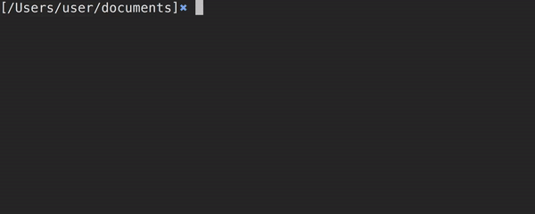
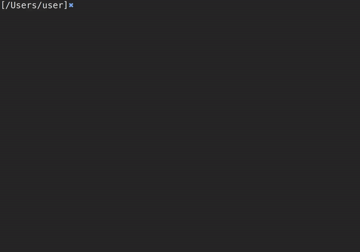
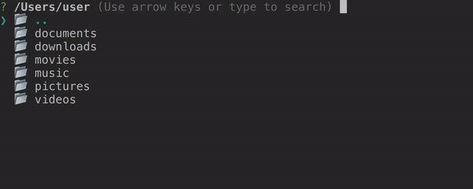

# nav

A command for simpler terminal navigation. 

### Features

- Easy to install and use.
- Searchable results.
- Dedicated commands.

### Commands

- `/showFiles` & `/hideFiles`: Whether files (non directories) should be shown in the listing. By default, files are hidden.  
- `/showHidden` & `/hideHidden`: Whether hidden files and directories should be shown in the listing. By default, hidden files and directories are hidden.

### Compatibility

Working on Unix based systems (macOS and linux). Not compatible with Windows.

### Requirements

- `node` to execute the scripts.
- `yarn` to install the dependencies.

### Installing nav 

- `git clone` this repository and `cd` into it.
- Run `yarn` to install its dependencies.
- Run `node alias.js` to get instructions on how to setup the command.

### Using nav

Changing the current working directory:

Text search:

Show files in the listing:

Show hidden files and directories in the listing:

